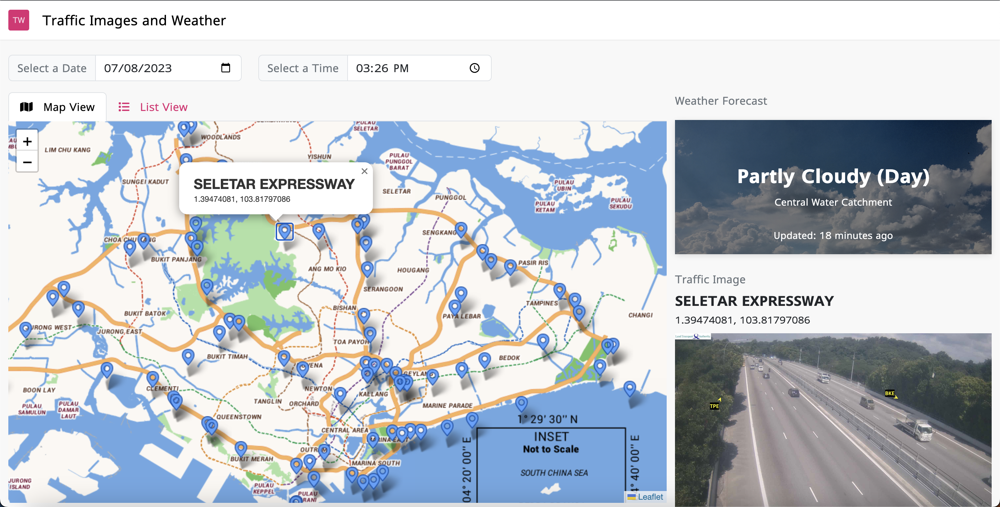

# Traffice Cam Images and Weather
A website to show traffic image and weather of different part of Singapore.



## Requirements
Tech stack to use:
- Backend: NestJs
- Frontend: ReactJs + TypeScript

To use the following 2 APIs.

1. Traffic Images (https://data.gov.sg/dataset/traffic-images)
2. Weather forecast (https://data.gov.sg/dataset/traffic-images)

## Assumption
To build a web app will a list of location will be shown, when the user click on a location, traffic image and weather information to be shown.
User will be able to select date and time as well.

## Fontend Decision
Instead of just the list UI, I think map UI is more user friendly as it's easier to find the location that I want to find. So I've decided to do both map and list UI as shown in the screenshot.

Clicking on the pin of the map and click a location from the list will select the location and show weather and traffic image.

The weather card to be improve with more background images for different weather condition.

## Backend decision
### Reverse geocoding
- Doing reverse geocoding take a long time especially if the list is long.
So I've decided to do it during the start of the application, on the NestJs module Init to be precise. It'll take a few seconds to start the application, once done the location API call are very fast. Saving in permanent storage such as Database is ideal.

- Some location might not be shown due to the OneMap couldn't find the geo data for that specific lat and long. That could be solve by processing reverse geocoding in a seperate task using different map.

### .env
I would never add a token in the .env file but this is for easy testing purpose for this specific case.
ONEMAP_TOKEN in the env will be expire by 8 Aug as token from OneMap only last for 3 days.

In case token expiry, you may get a new token from here https://www.onemap.gov.sg/apidocs/register

## How to start the application
Run the following command to start the website on local machine.

Install npm packages on the backend.

```
cd backend && npm i
```

Install npm packages on the frontend.

```
cd ..
cd frontend && npm i
```

Start the server by running the following command.

```
cd ..
npm run start
```

Backend server will take between 10 to 20 seconds to start due to the reverse geocoding process. By saving this data in the permanent database, this will not happen in the future.

Open http://localhost:3000 on the browser.

In case the browse open automatically, do refresh after 10/20 seconds about time the backend server started.